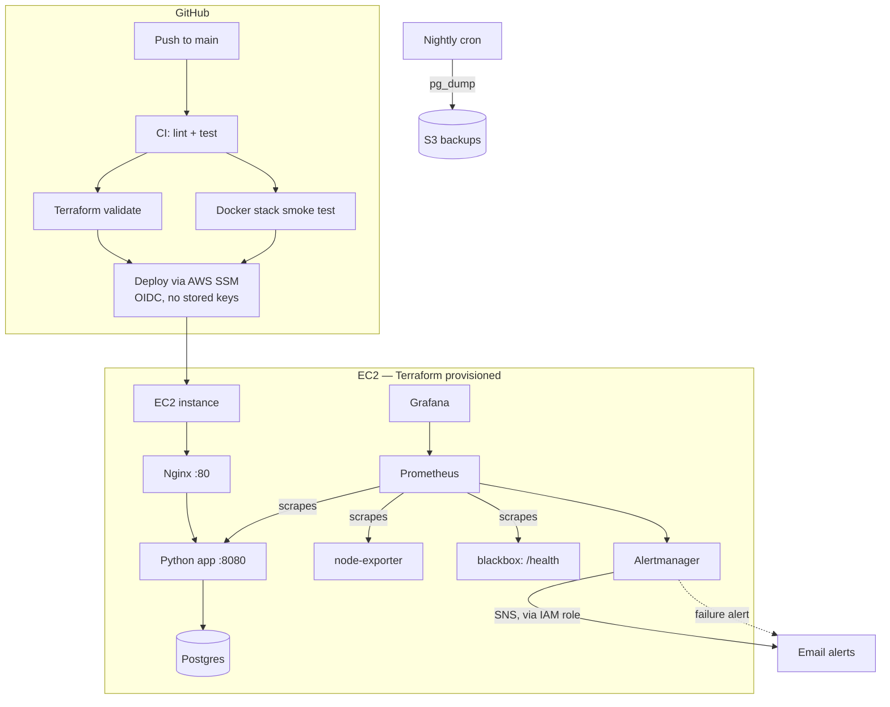
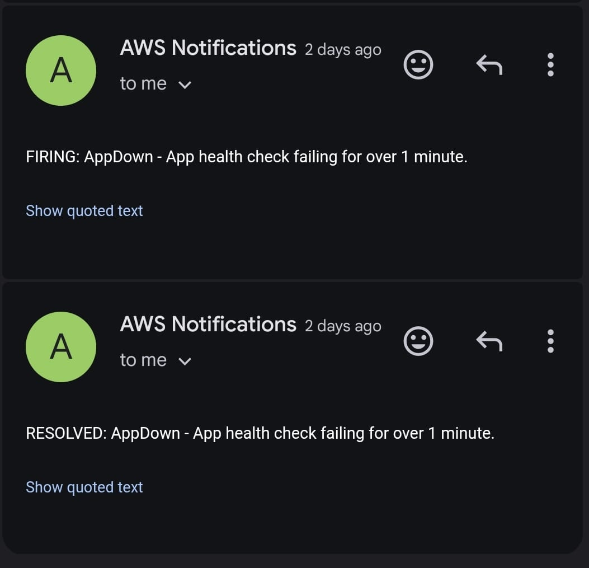
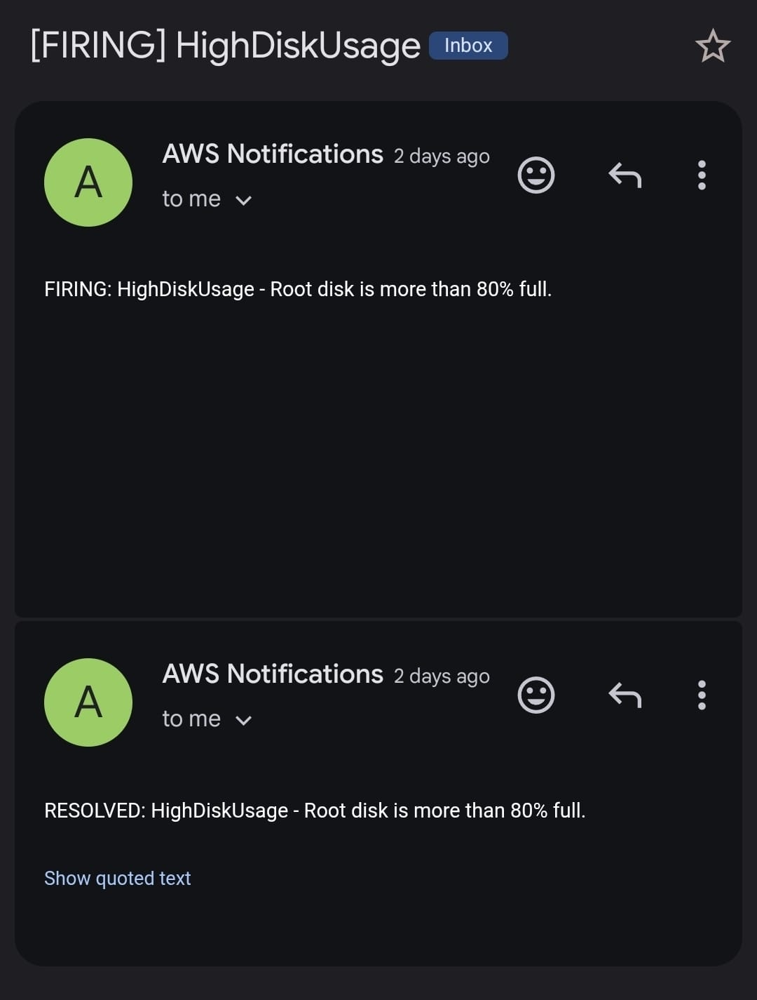

# Ops Baseline

A small, production-style AWS deployment built to demonstrate core DevOps practices end-to-end: infrastructure as code, containerized deployment, monitoring with alerting, automated backups, and CI/CD — all on a single EC2 instance, kept deliberately simple rather than over-engineered.

This isn't a toy demo. Every piece here was tested by deliberately breaking it: the app was killed, the disk was filled, the database was wiped, and a real deploy bug was caught and fixed using the actual logs and evidence, not guesswork.

## Architecture



**Why this shape:**
- **Nginx in front of the app** — tests the real request path, not just the app process directly.
- **Blackbox exporter probes `/health` through Nginx**, not the app container directly, so a broken proxy config is caught, not just a broken app.
- **No AWS access keys anywhere** — the EC2 talks to S3/SNS via an IAM instance role; GitHub Actions talks to SSM via OIDC. Both use short-lived, automatically rotated credentials.
- **Deploy goes over SSM, not SSH** — no inbound port opened for CI, and no SSH key stored in GitHub.

## What's here

| Component | Purpose |
|---|---|
| `terraform/` | EC2, security group, S3 backup bucket, SNS topic, IAM roles (EC2 + GitHub Actions deploy) |
| `app/` | Python HTTP app with a Postgres-backed calculation history |
| `docker-compose.yml` | App + Postgres + Nginx |
| `docker-compose.monitoring.yml` | Prometheus, Alertmanager, node-exporter, blackbox-exporter, Grafana |
| `monitoring/` | Prometheus scrape config, alert rules, Alertmanager → SNS config |
| `scripts/backup.sh` / `restore.sh` | Postgres → S3 backup and restore |
| `.github/workflows/ci.yml` | CI (test, validate, smoke-test) + CD (deploy via SSM) |
| `RUNBOOK.md` | Step-by-step response for the three failure scenarios below |

## Failure drills

Each of these was actually run against the live stack, not simulated.

### 1. App goes down
`docker compose stop app` → Prometheus' blackbox probe fails → `AppDown` alert fires after 1 minute → email via SNS. Bringing the app back sends a `RESOLVED` email within ~2 minutes.



### 2. Disk fills up
Root disk filled to ~85% with `fallocate` → `HighDiskUsage` alert fires after 2 minutes → email sent → space freed → `RESOLVED` email follows.



## CI/CD

Four jobs run on every push to `main` (the first three also run on pull requests):

1. **`app-test`** — flake8 + pytest against a real Postgres service container
2. **`terraform-validate`** — `fmt -check`, `init -backend=false`, `validate`
3. **`stack-smoke-test`** — validates the Compose file, Prometheus config, and Alertmanager config, then actually brings up app + db + nginx and curls `/health`
4. **`deploy`** — on push to `main` only: assumes an IAM role via OIDC (no stored AWS keys), looks up the running instance by tag, and deploys via `aws ssm send-command` (no SSH, no open inbound port for CI)

**A real bug this caught:** the deploy job initially reported success while silently deploying nothing. `git pull`, run as root via SSM inside a directory owned by `ubuntu`, failed on a "dubious ownership" safety check — but since the script had no `set -e`, the next line (`docker compose up --build`) ran anyway, rebuilt from a fully cached (unchanged) image, and exited 0. Diagnosed by comparing `git log` on the server against the deployed commit, then confirmed via `aws ssm get-command-invocation`. Fixed with `git config --system --add safe.directory` and `set -e` as the first line of the deploy script.

## Setup

Prerequisites: an AWS account, Terraform, Docker, and an SSH key pair.

```bash
cd terraform
terraform init
terraform apply    # creates EC2, S3 bucket, SNS topic, IAM roles

ssh -i <key> ubuntu@<public_ip>
git clone <this repo>
cd ops-baseline
cp .env.example .env    # fill in real values
docker compose up -d --build
```

See `RUNBOOK.md` for day-2 operations (what to do when something breaks).

## Known limitations

- **Terraform state is local**, not in an S3 backend with locking. Fine for a single-operator project; a team would need remote state.
- **The health check is shallow** — `/health` returns `OK` without touching the database, so a broken DB connection wouldn't be caught by the `AppDown` alert alone.
- **`force_destroy = true` on the S3 bucket** means `terraform destroy` deletes all backups along with the infrastructure. Deliberate for a demo project; not what you'd want in production.
- **Backups are skipped if the instance is stopped** at the scheduled cron time (02:00 UTC).

## Cost

Roughly $1/day running continuously (t3.small + Elastic IP + 20GB gp3). `terraform destroy` tears everything down; `terraform apply` rebuilds it in under 5 minutes.
